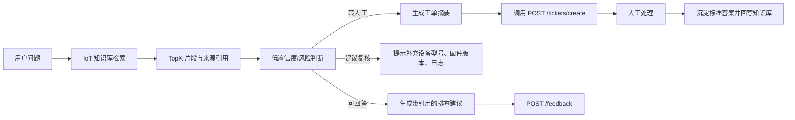

# FastGPT Workflow Notes

本项目不把 FastGPT 源码提交到仓库。FastGPT 作为本地 RAG / Workflow 工具使用，本仓库保存自己的数据集、Prompt、诊断规则、工单服务、评测脚本和展示文档。

## 已完成配置

- FastGPT Web：[http://localhost:3000](http://localhost:3000)
- 知识库名称：`IoT 设备售后知识库`
- 集合名称：`IoT 售后知识分块`
- 导入数据：`data/processed/knowledge_chunks.csv`
- 导入数量：124 条
- 应用名称：`IoT Support Copilot`
- 检索方式：向量检索，后续页面可切换混合检索与 Rerank
- 工单接口：`POST http://host.docker.internal:8000/tickets/create`

## 自动化脚本

导入知识库：

```powershell
.\.venv\Scripts\python.exe scripts\import_fastgpt_dataset.py
```

创建应用：

```powershell
.\.venv\Scripts\python.exe scripts\create_fastgpt_app.py
```

演示 FastGPT 检索到本地工单：

```powershell
.\.venv\Scripts\python.exe scripts\fastgpt_ticket_flow_demo.py "GW-200 报 E104 且 MQTT 连接超时，应该怎么排查？"
.\.venv\Scripts\python.exe scripts\fastgpt_ticket_flow_demo.py "客户要求赔偿停机损失，现场设备冒烟并且历史数据全部丢失，应该怎么答？"
```

## 工作流目标



## Prompt 约束

系统 Prompt 使用 [prompts/rag_answer.md](../prompts/rag_answer.md)：

- 只基于知识库片段回答。
- 回答必须包含排查步骤和来源引用。
- 错误码不存在、资料不足、投诉/赔偿/安全事故/数据丢失时建议转人工。

低置信度判断使用 [prompts/handoff_gate.md](../prompts/handoff_gate.md)：

- TopK 命中为空或相似度过低：转人工。
- 问题包含未知错误码：转人工。
- 涉及安全、法律、赔偿、投诉、数据全部丢失：转人工。
- 设备型号、固件版本、日志缺失但资料部分相关：建议复核。

工单摘要使用 [prompts/ticket_summary.md](../prompts/ticket_summary.md)。

## FastGPT 页面继续完善

当前脚本已创建“开始节点 -> 知识库检索节点 -> AI 回答节点”的基础应用。页面里建议继续增加：

- 条件分支节点：根据风险关键词、TopK 分数、是否命中错误码判断路由。
- HTTP 请求节点：转人工时调用 `http://host.docker.internal:8000/tickets/create`。
- 反馈节点：回答后调用本项目 `/feedback` 记录答案是否有用。

这样展示时可以同时说明“可视化工作流”和“本仓库代码闭环”两部分。
